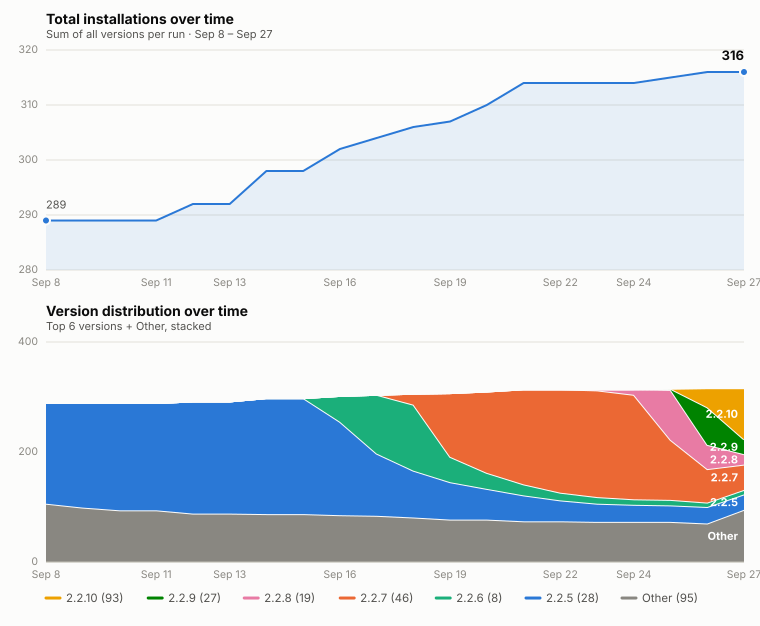

# Download Statistics

Last updated: 2026-10-06 08:25 UTC

**Total installations: 320**

| Version | Installations |
| --- | --- |
| 2.2.12 | 200 |
| 2.2.11 | 9 |
| 2.2.10 | 4 |
| 2.2.9 | 5 |
| 2.2.8 | 2 |
| 2.2.7 | 13 |
| 2.2.6 | 6 |
| 2.2.5 | 20 |
| 2.2.3 | 5 |
| 2.2.2 | 3 |
| 2.2.1 | 14 |
| 2.2.0 | 1 |
| 2.1.3 | 1 |
| 2.1.0 | 7 |
| 2.0.0 | 7 |
| 1.21.12 | 2 |
| 1.21.10 | 3 |
| 1.21.8 | 1 |
| 1.21.4 | 2 |
| 1.21.1 | 1 |
| 1.21.0 | 2 |
| 1.19.10 | 1 |
| 1.19.9 | 1 |
| 1.19.7 | 1 |
| 1.19.6 | 1 |
| 1.19.4 | 2 |
| 1.19.2 | 1 |
| 1.19.1 | 3 |
| 1.8.1 | 2 |
