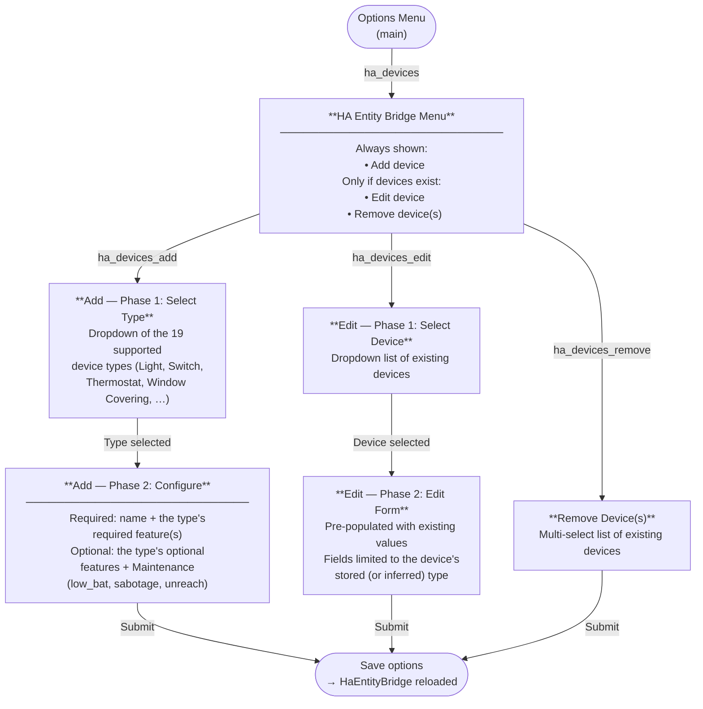

# HA Entity Bridge Flow (Alpha)

## Overview

The HA Entity Bridge allows exposing Home Assistant entities to the HCU as virtual plugin devices. The HCU sees them as native devices with typed features (e.g. `switchState`, `actualTemperature`, `maintenance`) and can display, automate, and — for controllable types — switch them.

The feature is configured via **Settings → Integrations → HCU → Configure → Home Assistant Entities → HCU (Alpha)**.

---

## Options Flow Diagram



---

## Step Details

### Menu (`ha_devices`)

| Condition | Available actions |
|-----------|-------------------|
| No devices configured | Add |
| ≥ 1 device configured | Add · Edit · Remove |

### Add Device (`ha_devices_add`) — Two-Phase

**Phase 1** — Device-type selector: dropdown with all 19 supported types (see [Supported Device Types and Features](#supported-device-types-and-features)). The choice determines which fields phase 2 shows.

**Phase 2** — Configuration form:

| Field | Type | Description |
|-------|------|-------------|
| `name` | Text | Display name shown on the HCU (required) |
| Required feature field(s) | Entity selector | The type's required feature(s), e.g. `on_off` for `SWITCH`/`LIGHT` |
| Optional feature fields | Entity selector | The type's optional features, plus Maintenance (`low_bat`, `sabotage`, `unreach`), always offered |

On submit: a new device dict `{id, name, type, features}` is appended to `CONF_HA_DEVICES` and options are saved. `type` is the value chosen in phase 1.

### Edit Device (`ha_devices_edit`) — Two-Phase

**Phase 1** — Device selector: dropdown with all configured devices (label = device name).

**Phase 2** — Edit form: identical to Add's phase 2, pre-populated with the existing entity assignments and limited to the fields relevant for the device's type. The `id` and `type` are preserved unchanged. The type itself cannot be changed here — remove and re-add the device to change its type.

On submit: the device in `CONF_HA_DEVICES` is replaced in-place.

### Remove Device(s) (`ha_devices_remove`)

Multi-select list. Multiple devices can be deleted in one step.

On submit: selected `id`s are filtered out of `CONF_HA_DEVICES`.

---

## Device Type Detection

Since 2.2.0 the device type is chosen explicitly in the Add flow and persisted as `type` on the device dict — several types (e.g. `EV_CHARGER` vs. `ENERGY_METER`, both just `power`/`energy`) share identical feature keys and can't be told apart from features alone.

`determine_ha_device_type()` in `const.py` still exists as a **fallback for devices saved before this field existed** (and is used opportunistically once, on first edit, after which the resolved type is persisted too). Its priority order:

```
LIGHT               if brightness / color_temp / rgb_color present
                    OR on_off entity starts with "light."
HEAT_PUMP           if climate_operation_mode present
THERMOSTAT          if set_point_temp present
WINDOW_COVERING     if shutter_level present
ENERGY_METER        if power or energy present
PARTICULATE_MATTER_SENSOR  if pm1 / pm25 / pm10 present
CLIMATE_SENSOR      if temperature / humidity / illuminance / co2 /
                       wind_speed / precipitation / storm / sunshine /
                       raining / wind_direction / sunshine_duration present
OCCUPANCY_SENSOR    if motion or occupancy present
CONTACT_SENSOR      if door, window, or contact_sensor present
SMOKE_ALARM         if smoke present
WATER_SENSOR        if moisture or moisture_detected present
VEHICLE             if vehicle_range present
BATTERY             if battery present
SWITCH              (fallback)
```

Note `EV_CHARGER`, `GRID_CONNECTION_POINT`, `HVAC`, `INVERTER`, and `SWITCH_INPUT` are intentionally absent from this list — they are only reachable via explicit selection in the Add flow.

---

## HCU Protocol Integration

Once saved, `HaEntityBridge` is active and responds to HCU plugin protocol messages:

### DISCOVER_REQUEST → DISCOVER_RESPONSE

All configured devices, of any of the 19 supported types, are returned as plugin devices with typed feature descriptors — this is currently unverified against real HCU firmware; if a `deviceType` value turns out to be rejected or ignored, restrict `_DISCOVERABLE_DEVICE_TYPES` in `ha_entity_bridge.py` back down.

`modelType`/`firmwareVersion` reflect the *real* HA device behind the bridged entity when it belongs to one (via the entity registry → device registry lookup in `_get_ha_device_info()`), falling back to the generic placeholders (`"Homeassistant"` / `"0.0.0"`) for entities with no backing device (helpers, templates).

```json
{
  "deviceId": "ha.<uuid>",
  "friendlyName": "Living Room Light",
  "modelType": "Homeassistant",
  "firmwareVersion": "0.0.0",
  "deviceType": "LIGHT",
  "features": [
    {"type": "switchState"},
    {"type": "dimming"},
    {"type": "maintenance"}
  ]
}
```

Devices we include this way are reported back by the HCU in its regular device list too, under an HCU-generated `id` (our `ha.<uuid>` only survives in a `pluginDeviceId` field there) — `discovery.py` recognizes and skips these so they don't get re-imported into Home Assistant as a duplicate device.

### INCLUSION_EVENT / EXCLUSION_EVENT

Sent by the HCU when devices are included/excluded on its side.

- **INCLUSION_EVENT**: for each included device ID we still know about, an immediate `STATUS_EVENT` is sent (`send_status_event`). For any `ha.*` ID in the event that we *don't* know about anymore (removed from `CONF_HA_DEVICES` but still present on the HCU), a non-fixable repair issue (`ha_entity_excluded`) is created — pointing at removing it via the Homematic IP app, or re-adding it if unintentional (`handle_stale_inclusion_devices`).
- **EXCLUSION_EVENT**: currently only logged, no further action taken.

### STATUS_REQUEST → STATUS_RESPONSE / STATUS_EVENT

Current HA state is read and mapped to HCU feature value objects. `STATUS_REQUEST` can ask for specific device IDs or (if none given) all of them.

```json
{
  "deviceId": "ha.<uuid>",
  "features": [
    {"type": "switchState", "on": true},
    {"type": "dimming", "dimLevel": 0.75},
    {"type": "maintenance", "lowBat": false, "sabotage": false, "unreach": false}
  ]
}
```

`STATUS_EVENT` is pushed automatically on every relevant HA state change. A send is only throttled (max once per 5 seconds per device) if the resulting feature values are *identical* to what was last reported — an actually different value always goes out immediately, no matter how recently the last one was sent, so a real state change is never delayed or dropped by the throttle.

### CONTROL_REQUEST (SWITCH / LIGHT only)

The HCU can turn SWITCH and LIGHT devices on/off. Dimming and color control are also supported for LIGHT devices.

**Optional `onTime` (auto-off timer)**

If an `onTime` entity is configured or the CONTROL_REQUEST itself contains an `onTime` feature, the device is automatically turned off after the specified number of seconds.

Priority: value in CONTROL_REQUEST > value from configured `on_time` entity.

```
turn_on called
  └─ if on_time_secs > 0
       └─ async task: sleep(on_time_secs) → turn_off
```

> **Known limitation:** a repeated `turn_on` with `on_time` set schedules another auto-off task without cancelling a still-pending one from an earlier `turn_on` — the earliest timer wins and can turn the device off sooner than the most recent command implied.

---

## Maintenance Composite Feature

Three separate HA `binary_sensor` entities combine into a single HCU `maintenance` feature object. All three are optional.

| Config key | HCU field | Meaning |
|---|---|---|
| `low_bat` | `lowBat` | Battery low |
| `sabotage` | `sabotage` | Tamper contact triggered |
| `unreach` | `unreach` | Device unreachable |

In DISCOVER_RESPONSE a single `{"type": "maintenance"}` descriptor is emitted.  
In STATUS_RESPONSE / STATUS_EVENT the combined object is sent only if at least one of the three entities has a valid (non-unavailable) state.

---

## Supported Device Types and Features

| Device type | Required | Optional |
|---|---|---|
| `SWITCH` | `on_off` | `on_time`, Maintenance |
| `LIGHT` | `on_off` | `brightness`, `color_temp`, `rgb_color`, `on_time`, Maintenance |
| `ENERGY_METER` | — | `power`, `energy`, Maintenance |
| `PARTICULATE_MATTER_SENSOR` | — | `pm1`, `pm25`, `pm10`, Maintenance |
| `CLIMATE_SENSOR` | — | `temperature`, `humidity`, `illuminance`, `co2`, `wind_speed`, `precipitation`, `storm`, `sunshine`, `raining`, `wind_direction`, `sunshine_duration`, Maintenance |
| `OCCUPANCY_SENSOR` | `occupancy` | Maintenance |
| `CONTACT_SENSOR` | `contact_sensor` | Maintenance |
| `SMOKE_ALARM` | `smoke` | Maintenance |
| `WATER_SENSOR` | `moisture` | `moisture_detected`, Maintenance |
| `BATTERY` | `battery` | `power`, `energy`, Maintenance |
| `EV_CHARGER` | `power` | `energy`, Maintenance |
| `GRID_CONNECTION_POINT` | `power` | `energy`, Maintenance |
| `HEAT_PUMP` | `climate_operation_mode` | `cooling_temp_offset`, `heating_temp_offset`, `presence_mode`, `hot_water_boost`, `supply_temperature`, Maintenance |
| `HVAC` | `power` | `energy`, Maintenance |
| `INVERTER` | `power` | `energy`, Maintenance |
| `SWITCH_INPUT` | — | Maintenance |
| `THERMOSTAT` | `set_point_temp` | `temperature`, `humidity`, `co2`, Maintenance |
| `VEHICLE` | `battery` | `vehicle_range`, Maintenance |
| `WINDOW_COVERING` | `shutter_level` | `slats_level`, `shutter_direction`, Maintenance |

**Maintenance** = `low_bat` + `sabotage` + `unreach` (all optional `binary_sensor` entities)

`motion` (for `OCCUPANCY_SENSOR`) and `door`/`window` (for `CONTACT_SENSOR`) are no longer offered in the Add/Edit form — the Connect API has only one feature for each (`PresenceDetected`, `ContactSensorState`), so `occupancy`/`contact_sensor` cover both. All old keys are still recognized on devices saved before this change (`LEGACY_FEATURE_FALLBACK` in `const.py` migrates them to the current key the next time the device is edited and saved), and `HaEntityBridge` only ever sends one entry per feature type regardless — see `_build_discover_features`/`_build_value_features` in `ha_entity_bridge.py`.
