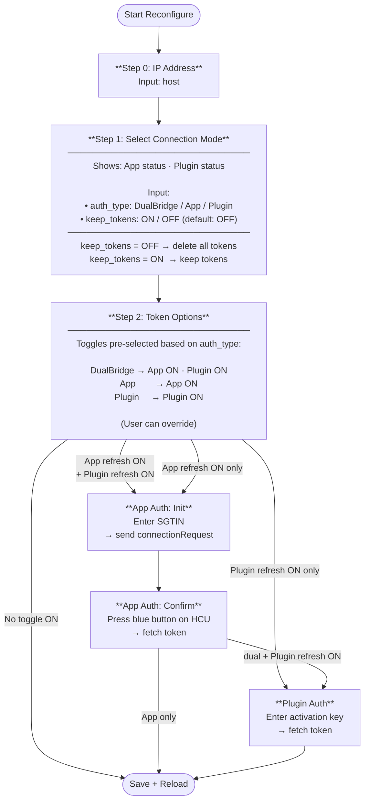

# Reconfigure Flow

## Overview

The reconfigure flow allows updating the IP address, connection mode, and authentication tokens without reinstalling the integration.

## Flow Diagram



## Step Details

### Step 0 — IP Address
- Input: hostname or IP of the HCU
- Always saved regardless of connection mode and tokens

### Step 1 — Select Connection Mode

| Field | Values | Default |
|-------|--------|---------|
| `auth_type` | DualBridge · App User · Plugin User | current mode |
| `keep_tokens` | ON / OFF | **OFF** |

- `keep_tokens = OFF` → all existing tokens and client IDs are deleted immediately
- `keep_tokens = ON` → existing tokens are retained

### Step 2 — Token Options

Toggles are pre-selected based on the chosen `auth_type`:

| auth_type | refresh_app_token | refresh_plugin_token |
|-----------|:-----------------:|:--------------------:|
| DualBridge | ✅ | ✅ |
| App User | ✅ | — |
| Plugin User | — | ✅ |

The user can override the toggles before submitting.

### App Auth (Init → Confirm)
1. **Init**: SGTIN is auto-detected (from running client or stored entry). `connectionRequest` is sent to the HCU.
2. **Confirm**: User presses the blue button on the HCU → token is fetched and saved.
- With DualBridge and Plugin refresh: continue to Plugin Auth
- Otherwise: save directly

### Plugin Auth
- Generate a new activation key in the HCU WebUI (Settings → Developer Mode)
- Token is fetched and verified
- Then: save + reload

## Token Logic Summary

```
keep_tokens=OFF → tokens deleted in step 1
keep_tokens=ON  → tokens retained

refresh_*=ON  → new token fetched via auth flow
refresh_*=OFF → existing token kept (or empty if deleted)
```
