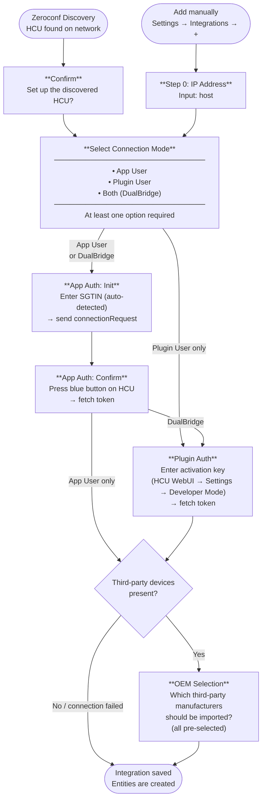

# Setup Flow (Initial Setup)

## Overview

The setup flow is executed once when the integration is added for the first time. It can be started via two entry points: manually or automatically via Zeroconf discovery.

## Flow Diagram

## Step Details

### Entry: Zeroconf Discovery
- HCU is automatically discovered on the network (`_ssh._tcp.local.` / `hcu1*`)
- IPv4 address is extracted
- Notification appears in HA → confirming starts the flow

### Entry: Manual
- User enters hostname or IP address
- Unique ID is set to the host → prevents duplicate setup

### Select Connection Mode

| Option | Description |
|--------|-------------|
| **App User** | Authentication via blue button on the HCU. REST + WebSocket (port 8888). |
| **Plugin User** | Authentication via activation key (Developer Mode). WebSocket (Plugin port). |
| **DualBridge** | Both modes in parallel. App User for state/commands, Plugin for advanced features. ⭐ Recommended |

At least one option must be selected.

### App Auth: Init → Confirm
1. **Init**: SGTIN is auto-detected. `connectionRequest` is sent to the HCU.
2. **Confirm**: User presses blue button → token + client ID are fetched and saved.
- With DualBridge: continue to Plugin Auth
- With App User only: continue to OEM selection

### Plugin Auth
- Generate a new activation key in HCU WebUI: **Settings → Developer Mode**
- Token is fetched and verified
- `auth_type` is set: `plugin` or `dual`

### OEM Selection
- Connection to the HCU is briefly established to detect third-party devices
- If no third-party devices found or connection fails → save directly
- If third-party devices found → user selects which to import (all pre-selected)
- Deselected OEMs are stored in `disabled_oems` in options

## Auth Types

| `auth_type` | App Token | Plugin Token |
|-------------|:---------:|:------------:|
| `app` | ✅ | — |
| `plugin` | — | ✅ |
| `dual` | ✅ | ✅ |
